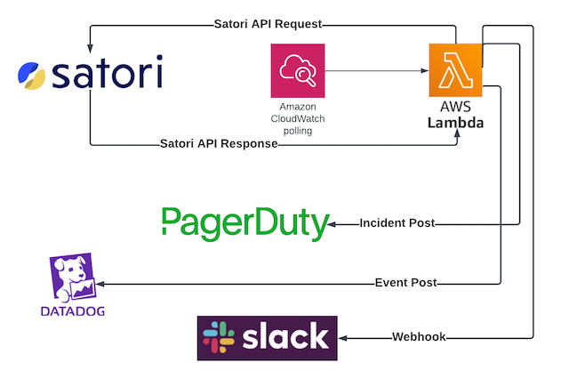

# satori-lambda-alerts
**AWS Lambda example for sending alerts to various downstream SIEMs/systems using Satori audit data.**



#### Overview

This is a lightweight, ready-to-use, terraform-deployable AWS Lambda example that searches for two types of Satori events, and sends them to any/all of three downstream systems: Slack, PagerDuty and Datadog. The supported Satori event types are:
- Blocked queries: queries which are blocked by Satori and have no additional request or self-service rules available to the blocked end user.
- Large record queries: queries which exceed a (configurable) record count threshold.

#### Quick Start

Requirements:

- You are an AWS admin who can retrieve and use [CLI credentials](https://docs.aws.amazon.com/singlesignon/latest/userguide/howtogetcredentials.html).
- You are a Satori admin and have access to the [Satori Rest API](https://app.satoricyber.com/docs/api).
- You have [Terraform](https://www.terraform.io/) deployed on your client (we tested with MacOS).
- You have one or more of three possible downstream systems and admin or dev access to their respective API's:
	- [Pagerduty](https://developer.pagerduty.com/docs)
	- [Datadog](https://docs.datadoghq.com/api/latest/events)
	- [Slack](https://api.slack.com/messaging/webhooks)

Steps:

- Download this repository.
- get your AWS CLI credentials and paste them into a new command line session.
- edit ```terraform.tfvars``` with all relevant info as documented here and in that file.
- deploy using ```terraform apply```.
- Test by running queries which will be blocked or have large record counts results depending on which type you selected.
- Observe in your downstream systems.

**_To use this example in a quick start manner, the only file you should need to change/edit is ```terraform.tfvars```_**

___

#### More Info

- This Lambda example is designed as a kind of template for a savvy Rest API developer and can be considered a starting point for creating additional alerts to additional systems.
	- _get_*_ files represent logic for getting satori audit data and then sending it along.
	- _post_*_ files represent helper logic for each of the downstream systems.
	- _satori_*_ files represent helper logic for interacting with the Satori Rest API.
	- _satori_lambda.py_ is the main entry point and will be called by AWS CloudWatch.
	- _*.tf_ files represent the various AWS resources created during the terraform deploy:
		- iam.tf: secrets, roles, and policies used by this example.
		- cloudwatch.tf: the scheduler that calls the AWS Lambda function.
		- main.tf: the packaging up of these python files and deployment to AWS Lambda. Note: we leverage an AWS 'layer' for Python v3.11
- The AWS Lambda function has a timeout of 180 seconds. If this is exceeded, consider looking into why that is the case from a 'Satori Audit Data' perspective.
- No matter what other settings are configured, this example will only retrieve 100 Satori audit records. If this is exceeded, consider looking into why that is the case from a 'Satori Audit Data' perspective.

#### General note About ```terraform.tfvars``` and managing secrets

- This example does not explore the nuance of where to store your secrets - the classic cloud 'chicken and egg' syndrome; there are a handful of ways to handle this correctly.
	- Instead, this example ships with an empty terraform.tfvars file and it is expected that you will place your sensitive info here. 
	- From there, this terraform example will create a proper AWS secret using AWS Secret Manager and assign the correct permissions in AWS.